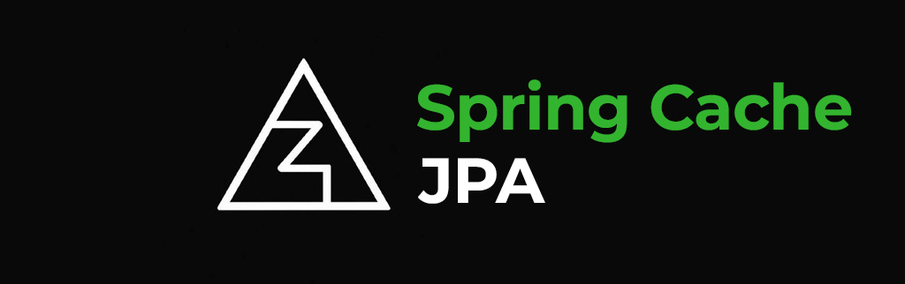

<h1 align="center">JPA Cache provider ⚡ for Spring 6.0.x+</h1>

Persistent, high-performance JPA cache provider for Spring Cache.  
Seamlessly integrates with your database, providing TTL, size limits, and eviction strategies out of the box.

 

## ✨ Features

* **TTL Support**: Automatic expiration of stale entries.
* **Size Limit & Eviction**: Configure a maximum number of entries per cache region and choose between LRU, LFU, or FIFO eviction policies.
* **Persistent Storage**: Cache survives application restarts and can be shared across multiple instances.
* **Automatic Leader-based Cleanup**: In clustered environments, ensures a single instance removes expired rows to avoid contention.
* **Zero Extra Dependencies**: Only Spring JPA and your existing database driver.

Stop reinventing the wheel — start shipping features! ⭐

---

## 🚀 Quick Start with Spring or Spring Boot

[Quick Start guide on the Wiki](https://github.com/)

## ⚙️ Configuration

[Configuration on the Wiki](https://github.com/)

## 🌍 Roadmap
* 📊 **Micrometer metrics**

Give the project a ⭐ if you like the vision — it fuels development!

## 🤝 Contributing
1. **Fork** → `git clone` → feature branch.
2. `./gradlew build`.
3. Open **PR** with green CI.

Questions? Create an issue or join discussions!

## 📜 License
**Apache License 2.0** — free for personal & commercial use.

> Built with ☕ & ❤️ by [@AdmiralXy](https://github.com/AdmiralXy) — Happy coding!
